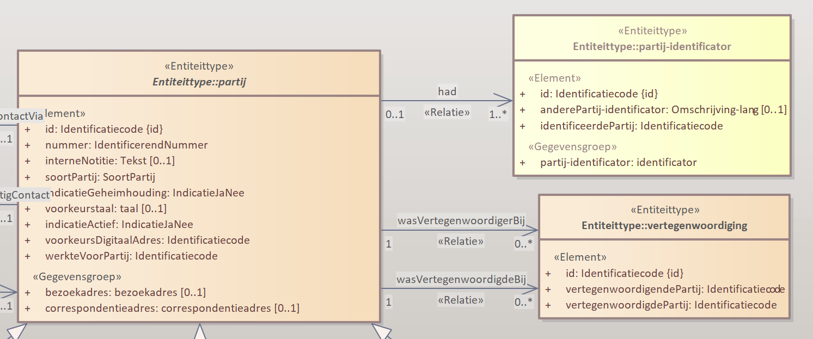

# V6577 - Wordt de identificerende property door de provider of door de consumer toegekend ? 

## Vraagstuk

Bij de implementatie van de API's voor Zaakgericht Werken is de implementatiekeuze gemaakt om de UUID door de provider toe te laten kennen. 
Binnen de API is de UUID de identificerende property (vanaf nu ID genoemd) van een object. 

Gevolg van de keuze dat de ID door de provider wordt gegenereerd is dat deze ID pas bekend is als een object door de provider is gegenereerd. 

Dat betekent dat relaties tussen objecten pas kunnen worden vastgelegd als het object waarnaar wordt verwezen is vastgelegd door de provider. 
Deze situatie creëert het ongewenste effect dat er objecten vastgelegd worden zonder dat de gerelateerde objecten ook worden vastgelegd. 

Als voorbeeld nemen we de `partij` en de `partij-identificator`. Zie onderstaande afbeelding,

De `partij` zal eerst vastgelegd moeten worden om de UUID beschikbaar te krijgen. De UUID wordt dan gebruikt om bij het vastleggen van de `partij-identificator` de relatie tussen de `partij` en de `partij-identificator` te registreren (in identificeerdePartij). 
Totdat de `partij-identificator` succesvol is geregistreerd is er sprake van een van een inconsistente database. Er bestaat immers een `partij` zonder `partij-identificator` . Als er een probleem ontstaat bij het vastleggen van de `partij-identificator` is die inconsitentie van blijvende aard. 

## Mogelijke oplossingen (niet uitputtend)

Enkele oplossingen om deze inconsistentie te voorkomen zijn:

### Laat de ID door de consumer genereren

Door UUID's te gebruiken wordt gegarandeerd dat de ID's uniek zijn. Dan doet het er niet meer toe of die door de provider of de consumer worden gegenereerd. 
Door de UUID door de gebruiker te laten genereren kan de gebruiker de juiste volgorde van vastlegging hanteren. 
  - Genereer de UUID's van `partij` en van `partij-identificator`
  - Leg de `partij-identificator` vast (met verwijzing naar de `partij` en andere ingevulde properties)
  - Leg de `partij` vast.

Nadeel: Als er tussen het vastleggen van de `partij-identificator` en het vastleggen van de `partij` iets misgaat onstaat er een "losse" partij-identificator met een verwijzing naar een niet bestaande `partij`. 
Dat is nog steeds niet fijn, maar een kleiner probleem dan een losse `partij`.   

### Bied beide objecten in 1 call aan (transactie)

Bied zowel partij als partij-identificator samen aan in 1 Call. 
Door beide objecten aan te bieden waarbij bijvoorbeeld het ene object inline onderdeel uitmaakt van het andere object kunnen beide objecten in 1 transactie worden vastgelegd. 
In de response worden dan de gebruikte UUID's teruggekoppeld.
Door bij alle situaties waar dit probleem ontstaat de betreffende objecten in samenhang in 1 call aan te bieden is er een mogelijkheid om database inconsitentie te voorkomen.

Bij deze oplossing is het niet relevant of de UUID's door de consumer of door de provider worden toegekend. 

### Definieer Handelingen

Door de gewenste registratie te koppelen aan de functionele wens kunnen naast de database integriteit ook sommige "zachtere" bedrijfsregels al in de API-call worden afgedwongen.

