# Basisterminologie klantinteracties

Deze pagina beschrijft een toelichting bij kernconcepten die binnen het domein van klantinteracties worden erkend. Deze toelichting dient als inleiding tot en aanvulling bij het [semantisch informatiemodel Klantinteracties](informatiemodel/semantisch_model.md). In de illustraties bij deze toelichting wordt een drietal kleuren gebruikt:

1. blauwgekleurde concepten (bijvoorbeeld partij en klantcontact) hebben hun ‘thuis’ in het domein klantinteracties;
2. van rozegekleurde concepten (bijvoorbeeld zaak en informatieobject) verwachten we dat die buiten dit domein (gestandaardiseerd) beschikbaar zijn of komen, en
3. paarsgekleurde concepten (medewerker, organisatorische eenheid en geautomatiseerde actor) hebben we nodig om het domein goed te laten werken, maar ‘horen’ eigenlijk niet daarbinnen. Deze zouden op termijn dus weer uit het domein kunnen verdwijnen. Zie ook de toelichting bij [actor](#actor).

## Begripsverklaring

In deze toelichting wordt een aantal begrippen genoemd. Het grootste deel daarvan is gedefinieerd in het informatiemodel Klantinteracties:

- Klantcontact: een contact tussen een klant of een vertegenwoordiger van een klant en de gemeente;
- Partij: een persoon of organisatie waarmee de gemeente een relatie heeft;
- Actor: iets dat of iemand die voor de gemeente werkzaamheden uitvoert;
- Interne taak: iets dat door een actor moet worden gedaan om opvolging te geven aan een klantcontact.

Het informatiemodel Klantinteracties biedt afhankelijk van de situatie verschillende mogelijkheden om onderscheid aan te brengen tussen personen of organisaties die gelden als uiteindelijk belanghebbenden bij het handelen van de gemeente, en personen of organisaties die deze belanghebbenden vertegenwoordigen. Om dit verschil in algemene zin te duiden, worden in deze toelichting aanvullend de begrippen ‘klant’ en ‘vertegenwoordiger’ gebruikt:

- Klant: de persoon of organisatie die er belang bij heeft dat gemeente iets doet;
- Vertegenwoordiger: de persoon of de organisatie die namens één of meerdere klant(en) handelt in contact met de gemeente.

## Klantcontact

Een klantcontact is gedefinieerd als “een contact tussen een klant of een vertegenwoordiger van een klant en de gemeente”. Het doel van het klantcontact is tweeledig: enerzijds dient het om klanten of hun vertegenwoordigers inzicht te geven in (historische) contacten met de gemeente. En anderzijds om opvolging van hun verzoeken aan de gemeente te vergemakkelijken. Een klantcontact heeft om dit doel te dienen de volgende kenmerken:

1. Bij het klantcontact is altijd tenminste één [persoon of organisatie betrokken](#betrokkene-bij-het-klantcontact) die niet voor de gemeente werkt en iets van de gemeente wil. Er kunnen ook meerdere personen of organisaties betrokken zijn. *Er bestaat dus niet zoiets als een ‘intern’ (klant)contact voor verslaglegging over interacties tussen medewerkers van de gemeente.*
2. Bij het klantcontact is altijd tenminste één [persoon, afdeling of geautomatiseerde actor](#Actor) (zoals een chatbot) betrokken die de gemeente vertegenwoordigt of geldt als ontvanger van een boodschap. Er kunnen ook meerdere personen, afdelingen of geautomatiseerde actoren betrokken zijn.
3. Het klantcontact omvat de [inhoud](#inhoud-van-het-klantcontact) (informatie) die tijdens één contact of interactie over één [onderwerp](#onderwerp-van-het-klantcontact) wordt uitgewisseld of overgebracht. Komen tijdens één interactie meerdere onderwerpen aan de orde, dan ontstaan naar aanleiding van die interactie dus meerdere klantcontacten.
4. Het klantcontact bestaat ongeacht de vorm (gesprek, overgebrachte boodschap) van een contact en onafhankelijk van het kanaal (telefoon, website, e-mail) dat totstandkoming van het contact faciliteerde.
5. Het klantcontact bestaat pas nadat tussen daarbij betrokkenen contact tot stand is gekomen (in het geval van bijvoorbeeld een telefoongesprek), of als met grote waarschijnlijkheid verwacht mag worden dat een boodschap de geadresseerde zal bereiken (in het geval van bijvoorbeeld het verzenden van een brief aan een inwoner of het aanbieden van een bericht voor publicatie op MijnOverheid). *Er bestaat dus niet zoiets als een ’gepland’ of ‘toekomstig’ klantcontact.*
7. Het documentaire karakter van het klantcontact betekent dat dit na eerste vastlegging (behalve om fouten te herstellen) niet meer wordt gewijzigd. Eventuele handelingen die worden uitgevoerd omwille van [opvolging van een klantcontact](#opvolging-van-het-klantcontact) of instructies daarvoor zijn daarom geen onderdeel van dat klantcontact.

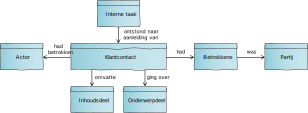

### Inhoud van het klantcontact

De inhoud van een klantcontact omvat de informatie die tijdens het contact is uitgewisseld of overgebracht, voor zover die informatie relevant is voor de betrokken persoon of organisatie, óf voor zover die informatie van belang is voor de [opvolging van klantcontact](#opvolging-van-het-klantcontact).

In sommige gevallen bestaat de inhoud van een klantcontact uit verschillende onderdelen, die bovendien verschillende vastleggingsvormen kunnen vereisen. Denk bijvoorbeeld aan een ontvangen e-mailbericht (‘platte’ tekst) met bijlagen (documenten). In andere gevallen kan het behulpzaam zijn om dezelfde inhoud in meerdere vormen (‘representaties’) vast te leggen. Zo kan het, om verdere geautomatiseerde verwerking mogelijk te maken, enerzijds raadzaam zijn de in een e-formulier ingevulde gegevens als gestructureerde data te registreren, terwijl het vanuit dienstverleningsoogpunt wenselijk is diezelfde gegevens in de vorm van een Pdf-bestand aan de indiener ter beschikking te stellen.

Om aan dit soort scenario's invulling te geven, kan de inhoud van een klantcontact in meerdere vormen vastgelegd worden, waarbij aan het klantcontact eventueel ‘bijlagen’ worden gerelateerd:

1. (‘platte’) tekst die de inhoud van het klantcontact beschrijft;
2. een verwijzing (via bijlage) naar het informatieobject (of document) dat (een deel van) de inhoud van het klantcontact beschrijft;
3. een verwijzing (via bijlage) naar het dataobject met een andere vorm dat (een deel van) de inhoud van het klantcontact beschrijft. Deze documentatie legt geen beperkingen op als het gaat om de objecttypen (en bijbehorende registers) die als bijlage geregistreerd mogen worden. Als voorbeeld kan het [register voor overige objectregistraties](https://vng.nl/projecten/overige-objecten-registratie-api) worden genoemd.

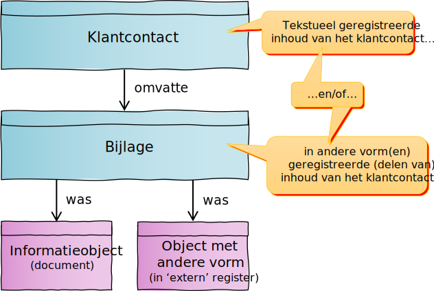

### Onderwerp van het klantcontact

Het klantcontact heeft [één onderwerp](./achtergronddocumentatie/artefacten/7682.md#meerdere-onderwerpen). Het onderwerp beschrijft waar het klantcontact over ging. Als het klantcontact een eenvoudig verzoek om informatie betrof (“wat zijn de voorwaarden voor kwijtschelding van gemeentelijke belastingen?”), zal zo’n onderwerp vaak een generiek karakter hebben.

Maar het onderwerp kan ook specifieker of persoonlijker zijn, en betrekking hebben op een specifiek voor één klant gestart proces (“kunt u toelichting geven bij het verzoek extra informatie aan te leveren om de aanvraag van mijn omgevingsvergunning te kunnen beoordelen?”). Om in verschillende situaties onderwerp(en) van het klantcontact te kunnen vastleggen, kunnen onderwerpen in diverse vormen worden geregistreerd. Hierbij worden aan het klantcontact eventueel ‘onderwerpobjecten’ gerelateerd:

1. (‘platte’) tekst die het onderwerp van het klantcontact beschrijft;
2. een verwijzing (via onderwerpobject) naar het klantcontact dat aanleiding gaf tot (een deel van) het (opvolgende) klantcontact;
3. een verwijzing (via onderwerpobject) naar de zaak waarover (een deel van) het klantcontactging;
4. een verwijzing (via onderwerpobject) naar de klanttaak waarover (een deel van) het klantcontact ging;
5. een verwijzing (via onderwerpobject) naar het dataobject met een andere vorm dat (een deel van) het onderwerp van het klantcontact beschrijft. Deze documentatie legt geen beperkingen op als het gaat om de objecttypen (en bijbehorende registers) die als onderwerpobject geregistreerd mogen worden.

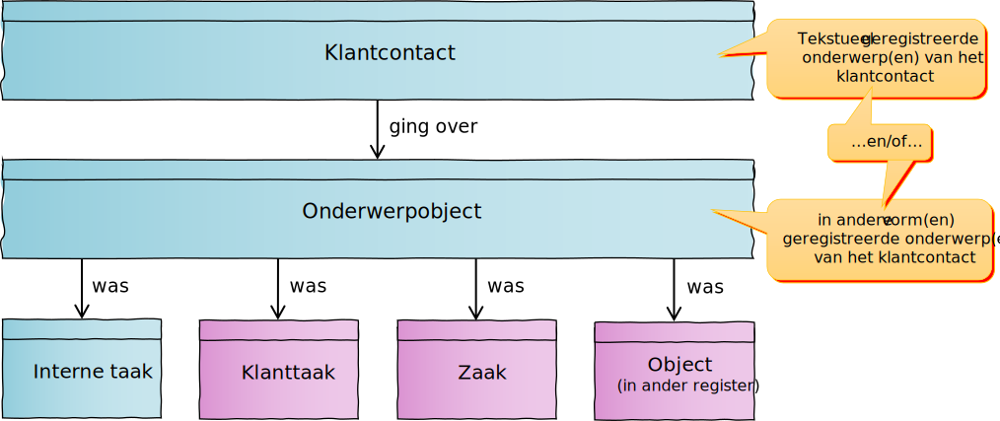

### Betrokkene bij het klantcontact

Zowel inzage in historische contacten met de gemeente als opvolging van verzoeken aan de gemeente maken het nodig bij te houden welke personen of organisaties bij klantcontacten betrokken waren. Daarvoor dient ‘betrokkene bij klantcontact’. Naast de rol die de betrokkene bij een klantcontact speelde (belanghebbende of vertegenwoordiger), kunnen hierin contactgegevens (in de vorm van zowel ‘fysieke’ als [‘digitale’](#digitaal-adres) adressen) worden vastgelegd. Deze dienen voor opvolging van het klantcontact.

Als de betrokkene bij het klantcontact als [partij gekend](#partij) is, en ófwel opvolging van het klantcontact in het geheel niet nodig is, ófwel voor die opvolging de bij partij vastgelegde contactgegevens mogen worden gebruikt, blijven de contactgegevens bij ‘betrokkene bij klantcontact’ leeg. In twee andere gevallen worden bij ‘betrokkene bij klantcontact’ wél contactgegevens geregistreerd:

1. Als de betrokkene bij het klantcontact als partij gekend partij is, maar deze partij wenst dat voor het opvolgen van het klantcontact eenmalig contactgegevens worden gebruikt die afwijken van de ‘default’contactgegevens die bij partij zijn geregistreerd.
2. Als de betrokkene bij het klantcontact niet als partij gekend is, maar opvolging van het klantcontact registratie van (enige) contactgegevens noodzakelijk maakt.

Als bij een contact geen enkele gekende partij betrokken is, én dat contact geen aanleiding geeft tot opvolging, dient het vastleggen van een klantcontact geen doel. Registratie kan in dit geval dus achterwege blijven.

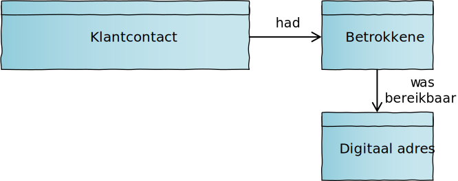

### Opvolging van het klantcontact

Het klantcontact zal in veel gevallen aanleiding geven tot vervolghandelingen, zoals het terugbellen van een betrokkene om de gevraagde informatie over te brengen of het starten van een proces dat het leveren van een aangevraagd product mogelijk maakt.

Omdat het klantcontact zoveel mogelijk een weergave is van tijdens een contact uitgewisselde of overgebrachte informatie, is het verzoek aan een collega of afdeling om naar aanleiding van het klantcontact vervolghandelingen uit te voren geen onderdeel van dat klantcontact. Hiervoor dient de interne taak.

Als een interne taak ertoe aanleiding geeft opnieuw contact op te nemen (bijvoorbeeld als een vraagsteller met een antwoord wordt teruggebeld), ontstaat een nieuw klantcontact met het klantcontact dat aanleiding gaf tot het aanmaken van de interne taak als onderwerp. Op deze manier kunnen het initiële klantcontact, de taak die als gevolg daarvan werd aangemaakt, en het klantcontact dat hoort bij de uitvoering van die taak aan elkaar worden gerelateerd.

Een klantcontact kan ook, zij het direct, zij het na nadat uit het uitvoeren van een interne taak bleek dat dit nodig of gewenst was, opgevolgd worden door het behandelen van een reeds lopende of nieuw te registreren zaak. In het eerste geval wordt de reeds lopende zaak beschouwd als onderwerp van het klantcontact. Deze relatie wordt vastgelegd in ‘onderwerpobject’. Als een klantcontact aanleiding gaf tot het starten met de behandeling van een nieuwe zaak, dan wordt vanuit de zaak verwezen naar het aanleidinggevend klantcontact. *Let op: vanuit een zaak kan op dit moment nog niet worden verwezen naar een ‘aanleidinggevend klantcontact’. Hiervoor is een wijziging in het bijbehorende informatiemodel nodig.*

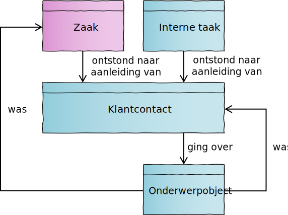

## Partij

Het registreren van partijgegevens dient twee doelen:

1. Het duurzaam vastleggen van (voor zover toegestaan) binnen de hele gemeente te gebruiken ‘default-’contactgegevens van personen en organisaties. Deze contactgegevens hebben daartoe een ‘duurzaam’ karakter, en (dus) een bestaansrecht dat langer kan duren dan het afhandelen van de vraag of het verzoek waarbij ze (voor het eerst) zijn verstrekt.
2. Het relateren van personen en organisaties aan de klantcontacten die zij met de gemeente hebben gehad zodat die in bijvoorbeeld een Mijnomgeving binnen de gemeentelijke website getoond kunnen worden. Dit doel betekent dat óók als tijdens een eerste contact tussen de gemeente en een persoon of organisatie geen voor hergebruik bedoelde contactgegevens worden verstrekt, het zinvol is een (in dit geval behalve een partij-identificator die verwijst naar gegevens in een extern register) ‘lege’ partij te registreren.

### Soorten partijen

Er zijn drie soorten partijen:
1. persoon
2. organisatie
3. contactpersoon

Een persoon is een [natuurlijk persoon](https://www.gemmaonline.nl/index.php/Rsgb_3.0/doc/objecttype/natuurlijk_persoon). Dit kan iedere persoon zijn die contact opneemt met de gemeente. Dus zowel een op een adres in de gemeente ingeschreven inwoner als een buitenlandse toerist die de gemeente een paar dagen bezoekt.

Dit betekent dat een persoon niet bij de gemeente ingeschreven hoeft te zijn, noch bekend hoeft te zijn in de Basisregistratie personen of het Register van niet-ingezetenen, noch hoeft te beschikken over een Burgerservicenummer om voor de gemeente als persoon (en dus partij) te gelden.

De reikwijdte van de partijsoort organisatie valt grotendeels samen met die van [niet-natuurlijk persoon](https://www.gemmaonline.nl/index.php/Rsgb_3.0/doc/objecttype/niet-natuurlijk_persoon). Echter kunnen organisaties in tegenstelling tot niet-natuurlijke personen wél eenmanszaken zijn, die weliswaar in het Handelregister zijn ingeschreven, maar geen rechtspersoonlijkheid kennen en formeel niet als ‘samenwerkingsverband’ gekenmerkt kunnen worden waardoor ze buiten de gangbare definities van niet-natuurlijk persoon vallen.

Ook organisaties met en zonder rechtspersoonlijkheid die niet in het Handelsregister zijn ingeschreven, zoals de Hoge Raad, in Nederland gevestigde ambassades en consulaten en buitenlandse ondernemingen, publieke instellingen en andersoortige samenwerkingsverbanden vallen binnen de bedoelde definitie van organisatie.

Een contactpersoon is “een persoon die (formeel of informeel) namens een andere persoon handelde of als werknemer of eigenaar namens een organisatie optrad”. Merk op dat nadrukkelijk de verleden tijd wordt gebruikt omdat de  vertegenwoordiging in het verleden op basis van toen actuele informatie is geregistreerd. Hiermee is niet gezegd dat de grond voor eerder vastgestelde (formele) vertegenwoordiging op een later moment nog geldt.

### Bedoeld voor contactgegevens

De partij dient voor het vastleggen van contactgegevens. Dit markeert het verschil tussen qua vorm op elkaar lijkende gegevensverzamelingen zoals ‘namen’ of ‘adressen’ die zowel in basisregistraties als bij partijen voorkomen: hun vastlegging heeft een andere aanleiding en dient een ander doel.

De persoonsnaam van een als partij geregistreerde persoon is de naam die deze persoon in contact met de gemeente wil gebruiken. Dit hoeft dus niet dezelfde persoonsnaam te zijn als die Basisregistratie Personen (BRP) is opgeslagen. Hetzelfde geldt voor adresgegevens. Het bezoekadres van een partij is het adres waar die partij zelf heeft aangegeven bezoek te willen ontvangen. Dit adres hoeft dus niet overeen te komen met een BRP-verblijfsadres of een in het Handelsregister bekend vestigingsadres. In sommige situaties mag echter voor correspondentie of bezoek geen adres worden gebruikt dat afwijkt van bijvoorbeeld het in de BRP bekende verblijfsadres van een persoon. Hiermee moet bij de inrichting van processen rekening worden gehouden.

Van wat we ‘digitale adressen’ noemen, bestaan in de basisregistraties slechts beperkt equivalenten. Digitale adressen dienen om bereikbaarheidsgegevens vast te leggen die niet zijn gebonden aan een locatie in de fysieke wereld (waar een bezoekadres, correspondentieadres of postbus wél horen bij zo'n fysieke locatie). Denk hierbij aan een e-mailadres, telefoonnummer of contactgegevens horend bij gebruikersprofielen op specifieke sociale mediaplatforms.

Aan een partij kan een onbeperkt aantal digitale adressen worden gerelateerd. Eén daarvan kan worden geregistreerd als voorkeursadres voor contact met de gemeente. Afwijkende contactgegevens kunnen (voor gebruik bij de afhandeling van één specifiek klantcontact) worden geregistreerd in [betrokkene bij klantcontact](#betrokkene-bij-klantcontact).

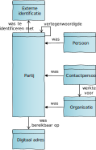

### Partijgegevens en basisgegevens

Partijen hebben een ‘relatie’ met de gemeente. Dit betekent dat de gemeente de persoon of organisatie achter een partij moet ‘kennen’. De gemeente weet dus over welke persoon of organisatie partijgegevens gaan, en dat degene die ze heeft verstrekt en eventueel voor hergebruik toestemming heeft gegeven daartoe gerechtigd was. Concreet betekent dit dat partijgegevens alleen geregistreerd mogen worden nadat met voldoende zekerheid is vastgesteld dat:

1. de persoon die gegevens verstrekt dezelfde persoon is als de persoon waarover gegevens worden verstrekt, ofwel
2. dat de persoon die ze verstrekt formeel gemachtigd is gegevens over een andere persoon te verstrekken, ofwel
3. dat de persoon die ze verstrekt formeel gemachtigd is gegevens over een organisatie te verstrekken.

Het ‘kennen’ van partijen betekent in de praktijk dat de gemeente beschikt over gegevens waarmee een partij in een extern register (dat zich buiten het domein van klantinteracties bevindt) uniek geïdentificeerd kan worden. Voor Nederlandse partijen zullen dit met name Burgerservicenummers, KVK- en RSIN-nummers zijn die hun bron hebben in de Basisregistratie Personen en het Handelsregister, maar dit kunnen ook andere binnen- of buitenlandse identificatienummers zijn. Deze identificerende gegevens kunnen worden in ‘partij-identificator’ worden vastgelegd.

### Partijgegevens en domein- of taakgebiedspecifieke gegevens

Het domein klantinteracties wordt wel een ‘generiek domein’ genoemd - het omvat gegevens die overal in de gemeente nuttig zijn en gebruikt kunnen worden. Maar binnen de gemeente worden ook veel gegevens over personen of organisaties ingewonnen en gebruikt die alleen binnen een specifiek gemeentelijk domein of taakgebied van belang zijn.

We hebben niet de ambitie deze specifieke gegevens in klantinteracties ‘te absorberen’. Het model dat daarvoor nodig is zou zeer omvangrijk en daardoor moeilijk onderhoudbaar worden. Wel willen we de verschillende gemeentelijke afdelingen in staat stellen te werken met dezelfde ‘basis’contactgegevens. De ‘partij-identificator’ maakt dit mogelijk. Daarin kunnen niet alleen gegevens worden geregistreerd waarmee een persoon of organisatie in een basisregistratie uniek kan worden geïdentificeerd, maar ook gegevens die verwijzen naar gegevensverzamelingen elders in de organisatie die met zo'n persoon of organisatie zijn verbonden.

In domein- of taakgebiedspecifieke gegevensverzamelingen kunnen de gegevens die qua betekenis of bedoeling sterk lijken op gegevens die (ook) al bij partij zijn vastgelegd, worden vervangen door verwijzingen naar partijgegevens. Dit stelt inwoners en ondernemers in staat op één plaats hun voorkeuren voor contact met de gemeente te beheren, en zorgt ervoor dat medewerkers, ongeacht de afdeling waarvoor ze werken, zoveel mogelijk beschikken over actuele contactgegevens van inwoners en ondernemers. Door de koppeling van domeinspecifieke gegevens aan partijgegevens kan bovendien een samengesteld klantbeeld worden opgebouwd, waarin (voor zover zinvol en toegestaan!) gegevens over een persoon of organisatie afkomstig uit meerdere gemeentelijke domeinen in samenhang worden getoond.

*N.B. deze documentatie schrijft niet voor niet onder welke voorwaarden het is toegestaan om voor het ene doel ingewonnen contactgegevens voor een ander doel te (her)gebruiken, maar erkent dat hiervoor toestemming nodig kan zijn. Evenmin beschrijft deze documentatie welke mate van betrouwbaarheid authenticatie- of identificatiemiddelen moeten bieden voordat partijgevevens kunnen worden geregistreerd, ingezien, verstrekt en aangepast. Wel stelt de documentatie dat deze middelen een aanzienlijke mate van zekerheid moeten bieden over de identiteit van degene die deze handelingen wil (laten) uitvoeren. Het verder invullen van deze voorwaarden is een taak voor juristen, privacy officers en beleidsmakers.*

## Actor

Een actor is “iets dat of iemand die voor de gemeente werkzaamheden uitvoert”. We onderscheiden drie verschillende soorten actoren: 

1. Medewerker: iemand die namens de gemeente werkzaamheden uitvoert;
2. Organisatorische eenheid: een organisatieonderdeel van de gemeente dat werkzaamheden uitvoert;
3. Geautomatiseerde actor: systeemcomponent dat namens de gemeente werkzaamheden uitvoert.

Waar de eerste twee waarschijnlijk voor zich spreken, verdient de laatste enige toelichting. Steeds meer gemeenten maken gebruik van chatbots en steeds verfijndere vragenbomen en ‘wizards’ om vragen of verzoeken van klanten zonder menselijke tussenkomst te beantwoorden. Vanuit klantperspectief is na een gesprek met een chatbot ‘gewoon’ contact geweest met de gemeente. Naar aanleiding hiervan ontstaat dus een klantcontact met de chatbot als geautomatiseerde actor.

Met name in relatie tot medewerkersgegevens is het belangrijk op te merken dat HR-systemen buiten het domein van klantinteracties vallen. Wat binnen dit domein is gemodelleerd moet bij het ontbreken van algemeen gebruikte standaarden voor het toegankelijk maken van medewerkers- en organisatiegegevens gezien worden als ‘stub’ die gegevens over organisatieonderdelen en medewerkers omvat voor zover die binnen dit domein van belang zijn.

## Registratievoorbeelden

Hieronder wordt voor een vijftal voorbeeldcasussen waarbij de gemeente contact heeft met klanten en/of vertegenwoordigers geïllustreerd welke gegevens daarover op welke manier worden geregistreerd.

*Deze voorbeelden zijn beschreven op basis van objecttypen die in het semantisch informatiemodel zijn onderkend. Deze zullen in nog te ontwikkelen API-specificaties niet vanzelfsprekend als afzonderlijke ‘resources’ herkenbaar zijn. Zo voorzien we bijvoorbeeld dat de specifieke vormen van Partij (Persoon, Contactpersoon en Organisatie) in één resource zullen worden samengevoegd.*

### Anoniem telefoongesprek leidt niet tot vervolgacties 

In deze casus voert een KCC-medewerker een telefoongesprek met een anonieme inwoner. Die heeft een vraag die zonder opvolging beantwoord kan worden. Omdat sprake is van gesprek met een inwoner van wie de identiteit niet bekend is, kan het klantcontact niet gebruikt worden om die inwoner te informeren over de inhoud van het contact dat die had met de gemeente. Omdat geen opvolging nodig is, hoeft ook om die reden geen klantcontact te worden geregistreerd. Naar aanleiding van deze casus ontstaat dus geen klantcontact.

### Baliegesprek leidt tot terugbelverzoek

In deze casus voert een medewerker van de gemeente een gesprek met een door een paspoort geïdentificeerde persoon. Deze persoon heeft eerder contactgegevens aan de gemeente verstrekt, waardoor de persoon als partij bij de gemeente bekend is. De vraag van de persoon kan niet door de medewerker aan de balie worden beantwoord; hiervoor zal een andere medewerker moeten terugbellen. Dit leidt tot registratie van een aan de gesproken partij gerelateerd klantcontact en een aan (collega)medewerker toegewezen interne taak met het verzoek terug te bellen. De persoon wil eenmalig (dus alleen voor de opvolging van dit klantcontact) wil worden teruggebeld op een telefoonnummer dat afwijkt van het bij partij geregistreerde telefoonnummer. Dit telefoonnummer wordt in een aan betrokkene bij klantcontact gerelateerd digitaal adres geregistreerd.

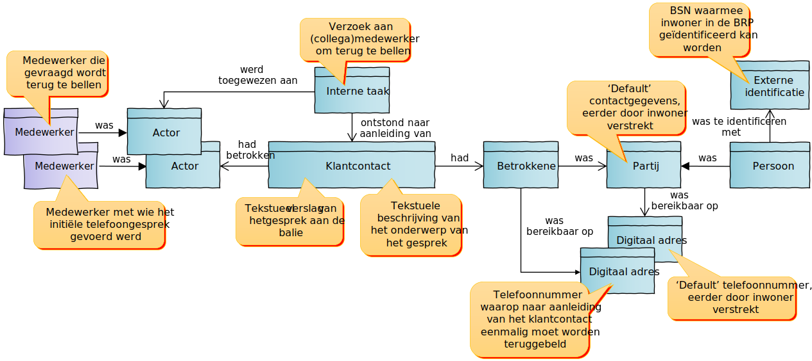

### Baliegesprek over twee onderwerpen leidt tot terugbelverzoek en zaak

Deze casus is gelijk aan de voorgaande, maar nu worden tijdens het baliegesprek twee onderwerpen behandeld. De persoon meldt een omgewaaide boom die nu een straat blokkeert, en informeert naar de mogelijkheden om geholpen te worden van schulden af te komen. Deze twee gespreksonderwerpen resulteren in twee separate klantcontacten, die ieder op een andere manier worden opgevolgd. De melding over de boom wordt behandeld als zaak van het type ‘melding openbare ruimte’, terwijl voor het leveren van de gevraagde informatie over schuldhulpverlening een interne taak aan wordt toegewezen aan een collega die werkt bij de afdeling ‘werk en inkomen’. Deze collega zal terugbellen op het telefoonnummer dat specifiek voor dat doel is verstrekt, terwijl voor eventuele vragen naar aanleiding van de zaakbehandeling het aan partij gerelateerde ‘default’-telefoonnummer van de persoon zal worden gebruikt.

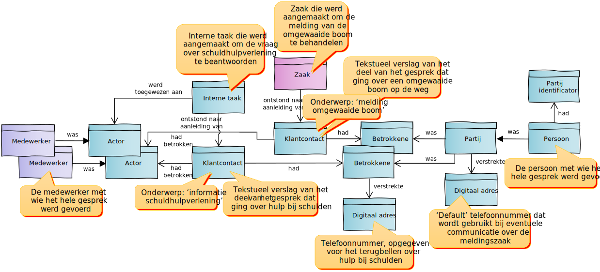

### Ontvangen e-mailbericht met bijlagen

In deze casus ontvangt de gemeente een e-mail met bijlagen. De e-mail beschrijft de aankondiging van een buurtfeest - de gemeente biedt aan deze op haar website te publiceren. Bijgevoegd zijn een flyer, waarin het feest wordt aangekondigd, en een routebeschrijving. Zowel het opgeslagen e-mailbericht als de individuele bijlagen worden als informatieobject (of document) opgeslagen en als bijlagen het klantcontact gerelateerd. Het is voor het leveren van deze dienst niet nodig met zekerheid te weten wie de afzender van de aankondiging is. Bovendien is ‘zekere’ identificatie naar aanleiding van e-mailadres niet mogelijk. Er wordt aan het klantcontact dus geen partij gerelateerd.

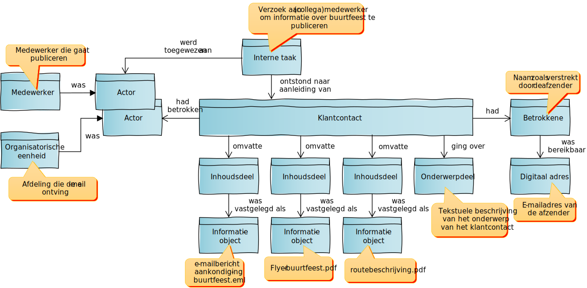

### Product aangevraagd door organisatie die persoon vertegenwoordigt

In deze casus dient een organisatie een aanvraag voor levering van een product of dienst in namens een persoon. Dat deze organisatie het recht heeft deze persoon te vertegenwoordigen is tijdens het aanvraagproces met voldoende zekerheid vastgesteld. De organisatie wordt tijdens deze aanvraag zelf ook vertegenwoordigd. Namelijk door de werknemer die de aanvraag indient.

Bij de aanvraag, die beschouwd kan worden als een specifieke vorm van een klantcontact, spelen dus drie partijen een rol:

1. de persoon die geldt als uiteindelijk belanghebbende;
2. de organisatie die namens de persoon handelt, en
3. de contactpersoon die voor de organisatie werkt.

De eerste twee kunnen op basis van authenticatie die onderdeel is van het aanvraagproces uniek worden geïdentificeerd in een basisregistratie. De persoon op basis van het BSN in de BRP, en de organisatie op basis van het RSIN in het Handelsregister. Uit het authenticatieproces blijkt ook dat de contactpersoon bevoegd is voor de organisatie te handelen. Maar deze bevoegdheid is niet op basis van een sleutelgegeven in een extern register op te vragen. De contactpersoon heeft daarom geen partij-identificator.

Kijken we naar de betrokkenheid bij het klantcontact dat als gevolg van de aanvraag wordt geregistreerd, dan zien we slechts twee van de bovengenoemde drie partijen terug. De organisatie heeft immers, in tegenstellig tot de werknemer (de contactpersoon) die voor deze organisatie werkt, geen contact met de gemeente gehad. Zij geldt daarom niet als betrokkene bij het klantcontact. Wel kan de betrokkenheid van de organisatie via de werkt-voor-relatie van de contactpersoon worden afgeleid.

Bij het indienen van de aanvraag heeft de contactpersoon via een e-formulier gegevens verstrekt. Deze gegevens worden gestructureerd opgeslagen in een specifiek register en als bijlage aan het klantcontact gerelateerd. Op basis van deze gestructureerde gegevens wordt geautomatiseerd een zaak aangemaakt van het juiste zaaktype, die een afdeling van de gemeente vervolgens kan behandelen.

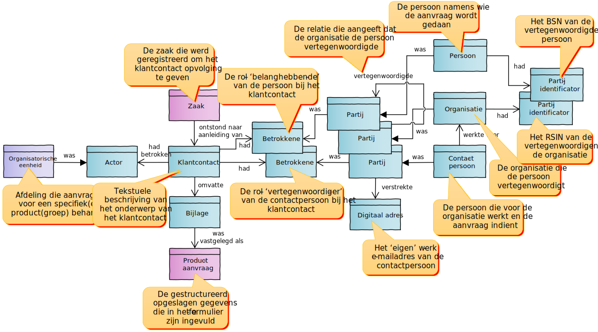

### Ontvangst van document bij lopende zaak

In deze casus levert een persoon extra informatie aan om de (verdere) behandeling van een lopende zaak mogelijk te maken. Dit gebeurt in een door authenticatie beschermd deel van de gemeentelijke website, waarbinnen aanvragers hun lopende zaken kunnen bekijken en in het kader daarvan aangeleverde informatie kunnen corrigeren en aanvullen. Omdat de gemeente dankzij authenticatie  weet wie de persoon is, en bovendien kennis heeft van de zaak waarbij de informatie hoort, kan vanuit het klantcontact een relatie worden gelegd naar de partij die de informatie aanlevert en (als onderwerp) de zaak waarop die betrekking heeft.

De aangeleverde informatie, die bestaat uit een Pdf-bestand dat het deel van de weg toont dat men vanwege een buurtfeest tijdelijk wil afsluiten, en in een contactformulier beschreven toelichting daarbij, wordt als twee bijlagen bij het klantcontact geregistreerd. De toelichting als tekst, het Pdf-bestand als informatieobject.

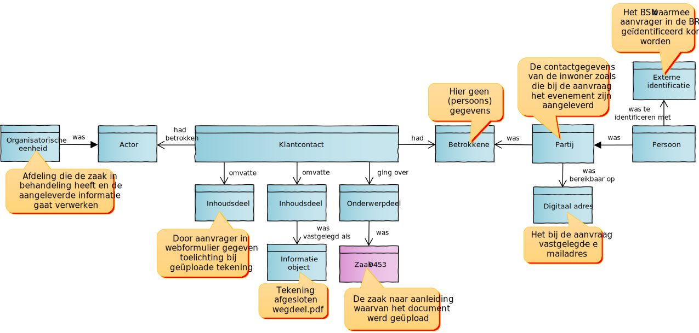