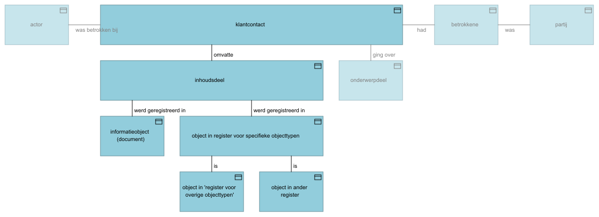
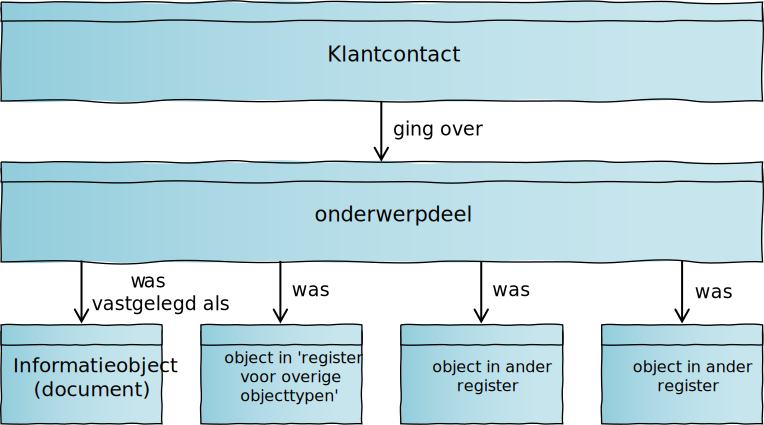

# Basisterminologie klantinteracties

Deze pagina beschrijft een toelichting bij kernconcepten die binnen het domein van klantinteracties worden erkend. Deze toelichting dient als inleiding tot en aanvulling bij het [semantisch informatiemodel Klantinteracties](informatiemodel/semantisch_model.md).

## Klantcontact

{:height="65%" width="65%"}

Een klantcontact is gedefinieerd als “een contact tussen een klant of een vertegenwoordiger van een klant en de gemeente”. Het doel van het klantcontact is tweeledig: enerzijds dient het om klanten of hun vertegenwoordigers inzicht te geven in (historische) contacten met de gemeente. En anderzijds om opvolging van hun verzoeken aan de gemeente te vergemakkelijken. Een klantcontact heeft om dit doel te dienen de volgende kenmerken:

1. Bij het klantcontact is altijd tenminste één [persoon of organisatie betrokken](#betrokkene-bij-het-klantcontact) die niet voor de gemeente werkt en iets van de gemeente wil. *Er bestaat dus niet zoiets als een ‘intern’ (klant)contact voor verslaglegging over interacties tussen medewerkers van de gemeente.*
2. Bij het klantcontact is altijd tenminste één [persoon, afdeling of geautomatiseerde actor](#Actor) (zoals een chatbot) betrokken die de gemeente vertegenwoordigt of geldt als ontvanger van een boodschap.
3. Het klantcontact omvat [inhoud](#inhoud-van-het-klantcontact) (die informatie die tijdens het contact is uitgewisseld of overgebracht) en heeft één of meerdere [onderwerp(en)](#onderwerp-van-het-klantcontact) (datgene waar het contact over ging).
4. Het klantcontact bestaat ongeacht de vorm (gesprek, overgebrachte boodschap) van een contact en onafhankelijk van het kanaal (telefoon, website, e-mail) dat totstandkoming van dit contact faciliteerde.
5. Het klantcontact bestaat pas nadat tussen daarbij betrokkenen contact tot stand is gekomen (in het geval van bijvoorbeeld een telefoongesprek), of als stellig verwacht mag worden dat een boodschap de geadresseerde zal bereiken (in het geval van bijvoorbeeld het verzenden van een brief aan een inwoner of het aanbieden van een bericht voor publicatie op MijnOverheid). *Er bestaat dus niet zoiets als een ’gepland’ of ‘toekomstig’ klantcontact.*
6. Het klantcontact heeft vanwege het besproken doel een ‘omvang’ of ‘duur’ die aansluit bij wat vanuit klantperspectief logisch is. Zo ‘duurt’ een klantcontact naar aanleiding van een telefoongesprek van het aannemen van het gesprek tot het beëindigen hiervan, terwijl een contact naar aanleiding van een baliebezoek de periode beschrijft vanaf het aan een medewerker verschijnen van een klant of vertegenwoordiger tot aan diens vertrek. Aan de andere kant resulteren een verzonden besluit en weken later daartegen ontvangen bezwaarschrift in twee ‘losse’ klantcontacten. Dit betekent dat binnen één klantcontact meerdere vragen kunnen worden gesteld, en dat daarbinnen meerdere [onderwerpen](#onderwerp-van-het-klantcontact) kunnen worden besproken.
7. Het documentaire karakter van het klantcontact betekent dat dit na eerste vastlegging (tenzij omwille van correcties met als doel het herstellen van fouten) niet meer wordt gewijzigd. Eventuele handelingen die worden uitgevoerd omwille van [opvolging van een klantcontact](#opvolging-van-het-klantcontact) of instructies daarvoor zijn daarom geen onderdeel van dat klantcontact.

### Inhoud van het klantcontact

{:height="88%" width="88%"}

De inhoud van een klantcontact omvat de informatie die tijdens het contact is uitgewisseld of overgebracht, voor zover die informatie relevant is voor de betrokken persoon of organisatie, óf voor zover die informatie van belang is voor de [opvolging van klantcontact](#opvolging-van-het-klantcontact). In sommige gevallen bestaat de inhoud van een klantcontact uit verschillende onderdelen, die bovendien verschillende vastleggingsvormen kunnen vereisen. Denk bijvoorbeeld aan een ontvangen e-mailbericht (‘platte’ tekst) met bijlagen (documenten). In andere gevallen kan het behulpzaam zijn om dezelfde inhoud in meerdere vormen (‘representaties’) vast te leggen. Zo kan het, om verdere geautomatiseerde verwerking mogelijk te maken, enerzijds raadzaam zijn de in een e-formulier ingevulde gegevens als gestructureerde data te registreren, terwijl het vanuit dienstverleningsoogpunt wenselijk is diezelfde gegevens in de vorm van een Pdf-bestand aan de indiener ter beschikking te stellen. Om te waarborgen dat de standaard aan dit soort scenario's invulling kan geven, wordt de inhoud van een klantcontact vastgelegd in één of meerdere ‘inhoudsdelen’, die ieder één van de volgende drie vormen kunnen hebben:

1. (‘Platte’) tekst die (een deel van) de inhoud van het klantcontact beschrijft.
2. Een verwijzing naar het informatieobject (of document) dat (een deel van) de inhoud van het klantcontact beschrijft.
3. Een verwijzing naar het dataobject dat (een deel van) de inhoud van het klantcontact beschrijft. De standaard legt geen beperkingen op als het gaat om de objecttypen (en bijbehorende registers) waarnaar vanuit een klantcontact verwezen mag worden, maar erkent expliciet het bestaan van het [register voor overige objectregistraties](https://vng.nl/projecten/overige-objecten-registratie-api).

### Onderwerp van het klantcontact

{:height="100%" width="100%"}

Naast inhoud heeft het klantcontact een onderwerp. Omdat (zeker tijdens een gesprek) ook meerdere onderwerpen besproken kunnen worden, kunnen dit ook meerdere onderwerpen zijn. Het onderwerp of de onderwerpen beschrijft waar het klantcontact over ging. Als het klantcontact een eenvoudig verzoek om informatie betrof (“wat zijn de voorwaarden voor kwijtschelding van gemeentelijke belastingen?”), zal zo’n onderwerp vaak een generiek karakter hebben. Maar het onderwerp kan ook meer specifiek of persoonlijk zijn en betrekking hebben op een specifiek voor één klant gestart proces (“kunt u toelichting geven bij het verzoek extra informatie aan te leveren om de aanvraag van mijn omgevingsvergunning te kunnen beoordelen?”). Om in verschillende situaties onderwerp(en) van het klantcontact te kunnen vastleggen, worden onderwerpdelen geregistreerd. Net als de klantcontactinhoud, kunnen deze kunnen verschillende vormen hebben:

1. (‘Platte’) tekst die (een deel van) het onderwerp van het klantcontact beschrijft.
2. Een verwijzing naar de interne taak die aanleiding gaf tot (een deel van) het klantcontact.
3. Een verwijzing naar de zaak waarover (een deel van) het klantcontactging.
4. Een verwijzing naar de klanttaak waarover (een deel van) het klantcontact ging.

### Betrokkene bij het klantcontact

{:height="65%" width="65%"}

Zowel inzage in historische contacten met de gemeente als opvolging van verzoeken aan de gemeente maken het nodig bij te houden welke personen of organisaties bij klantcontacten betrokken waren. Daarvoor dient ‘betrokkene bij klantcontact’. Naast de rol die de betrokkene bij een klantcontact speelde (belanghebbende of vertegenwoordiger), kunnen hierin contactgegevens (in de vorm van zowel ‘fysieke’ als [‘digitale’](#digitaal-adres) adressen) worden vastgelegd. Deze dienen voor opvolging van het klantcontact. Als de betrokkene bij het klantcontact als [partij](#partij) gekend is, en ófwel opvolging van het klantcontact in het geheel niet nodig is, ófwel voor die opvolging de bij partij vastgelegde contactgegevens mogen worden gebruikt, blijven de contactgegevens bij ‘betrokkene bij klantcontact’ leeg. In twee andere gevallen worden bij ‘betrokkene bij klantcontact’ wél contactgegevens geregistreerd:
1. Als de betrokkene bij het klantcontact als partij gekend partij is, maar deze partij wenst dat voor het opvolgen van het klantcontact eenmalig contactgegevens worden gebruikt die afwijken van de ‘default’contactgegevens die bij partij zijn geregistreerd.
2. Als de betrokkene bij het klantcontact niet als partij gekend is, maar opvolging van het klantcontact registratie van (enige) contactgegevens noodzakelijk maakt.

Als bij een contact geen enkele gekende partij betrokken is, én daarbij geen opvolging nodig, is geen van de twee doelen van klantcontact (bieden van inzicht in historische contacten en mogelijk maken van opvolging) gediend bij vastlegging van een klantcontact. Een contact met deze kenmerken is daarom geen aanleiding voor het ontstaan van een klantcontact.

### Opvolging van het klantcontact

{:height="65%" width="65%"}

Het klantcontact zal in veel gevallen aanleiding geven tot vervolghandelingen, zoals het terugbellen van een betrokkene met de gevraagde informatie of het starten van een proces dat het leveren van een aangevraagd(e) product of dienst mogelijk maakt. Omdat het klantcontact zoveel mogelijk een weergave is van tijdens een contact uitgewisselde of overgebrachte informatie, is het verzoek aan een collega of afdeling om naar aanleiding van het klantcontact vervolghandelingen uit te voren geen onderdeel van dat klantcontact. Hiervoor dient de interne taak. Als de interne taak ertoe aanleiding geeft opnieuw contact op te nemen (bijvoorbeeld als een vraagsteller met een antwoord wordt teruggebeld), ontstaat een nieuw klantcontact met de interne taak als onderwerp.

## Partij

{:height="54%" width="54%"}

Een partij is gedefinieerd als “een persoon of organisatie waarmee de gemeente een relatie heeft”. Partijgegevens gelden als in de hele gemeente te gebruiken ‘default’contactgegevens die gemeente kan gebruiken om contact op te nemen met personen of organisaties. Dit betekent dat sprake is van ‘duurzame’ gegevens, die een bestaansrecht hebben dat langer kan duren dan het afhandelen van de vraag of het verzoek waarbij ze (voor het eerst) zijn verstrekt. Het feit dat sprake is van een ‘relatie’ met de gemeente betekent dat de gemeente de persoon of organisatie achter een partij moet ‘kennen’. De gemeente weet dus welke persoon of organisatie partijgegevens beschrijven en dat degene die ze heeft verstrekt en eventueel voor hergebruik toestemming heeft gegeven daartoe gerechtigd was. Concreet betekent dit dat partijgegevens alleen geregistreerd mogen worden nadat met voldoende zekerheid is vastgesteld dat:
1. de persoon die gegevens verstrekt dezelfde persoon is als de persoon waarover gegevens worden verstrekt, ofwel
2. dat de persoon die ze verstrekt formeel gemachtigd is gegevens over een andere persoon te verstrekken, ofwel
3. dat de verstrekkende persoon formeel gemachtigd is gegevens over een organisatie te verstrekken.

Omdat sprake is van persoonsgegevens die niet mogen ‘lekken’, noch ongeautoriseerd gewijzigd mogen worden, gelden bovenstaande voorwaarden ook voor het op een later moment bieden van inzage in, verstrekking van of het (laten) wijzigen van partijgegevens.

### Persoon

Een persoon is een [natuurlijk persoon](https://www.gemmaonline.nl/index.php/Rsgb_3.0/doc/objecttype/natuurlijk_persoon). Dit kan iedere persoon zijn die contact opneemt met de gemeente. Dus zowel een op een adres in de gemeente ingeschreven inwoner als een buitenlandse toerist die de gemeente een paar dagen bezoekt. Dit betekent dat een persoon niet bij de gemeente ingeschreven hoeft te zijn, noch bekend hoeft te zijn in de Basisregistratie personen of het Register van niet-ingezetenen, noch hoeft te beschikken over een Burgerservicenummer om als persoon (en dus partij) bij de gemeente bekend te zijn.

### Organisatie

De reikwijdte van het begrip organisatie valt grotendeels samen met die van [niet-natuurlijk persoon](https://www.gemmaonline.nl/index.php/Rsgb_3.0/doc/objecttype/niet-natuurlijk_persoon). Echter kunnen organisaties in tegenstelling tot niet-natuurlijke personen wél eenmanszaken zijn, die weliswaar in het Handelregister zijn ingeschreven, maar geen rechtspersoonlijkheid kennen en formeel niet als ‘samenwerkingsverband’ gekenmerkt kunnen worden. Ook organisaties met en zonder rechtspersoonlijkheid die niet in het Handelsregister zijn ingeschreven, zoals de Hoge Raad, in Nederland gevestigde ambassades en consulaten en buitenlandse ondernemingen, publieke instellingen en andersoortige samenwerkingsverbanden vallen binnen de bedoelde definitie van organisatie.

### Contactpersoon

Een contactpersoon is een persoon die (formeel of informeel) namens een andere persoon handelde of als werknemer of eigenaar namens een organisatie optrad. Merk op dat nadrukkelijk de verleden tijd wordt gebruikt omdat de  vertegenwoordiging in het verleden op basis van toen actuele informatie is geregistreerd. Hiermee is niet gezegd dat de grond voor eerder vastgestelde (formele) vertegenwoordiging op een later moment nog geldt.

### Digitaal adres

Het digitaal adres dient om adressen vast te leggen die niet zijn gebonden aan een locatie in de fysieke wereld (waar een bezoekadres, correspondentieadres of postbus wél horen bij zo'n fysieke locatie). Denk hierbij aan e-mailadressen, telefoonnummers of op bereikbaarheidsgegevens op specifieke sociale mediaplatforms.

### Externe identificatie

Gegevens waarmee een partij in een extern (bron)register uniek geïdentificeerd kan worden. Voor Nederlandse partijen zullen dit met name Burgerservicenummers, KVK- en RSIN-nummers zijn, maar hierin mogen ook andere binnen- of buitenlandse identificatienummers worden vastgelegd.

## Actor

{:height="39%" width="39%"}

*Nog aanvullen*

### Medewerker

### Organisatorische eenheid

### Geautomatiseerde actor

## Toepassingsvoorbeelden

*Toepassing illustreren aan de hand van:*

- anoniem telefoongesprek waarin informatieverzoek aan het KCC waarbij geen opvolging nodig is
- telefoongesprek met partij waarin informatieverzoek waarvoor opvolging in de vorm van terugbelverzoek nodig is
- ontvangst van e-mailbericht met bijlagen
- indienen van e-formulier en behandelproces starten
- bericht publiceren berichtenbox?