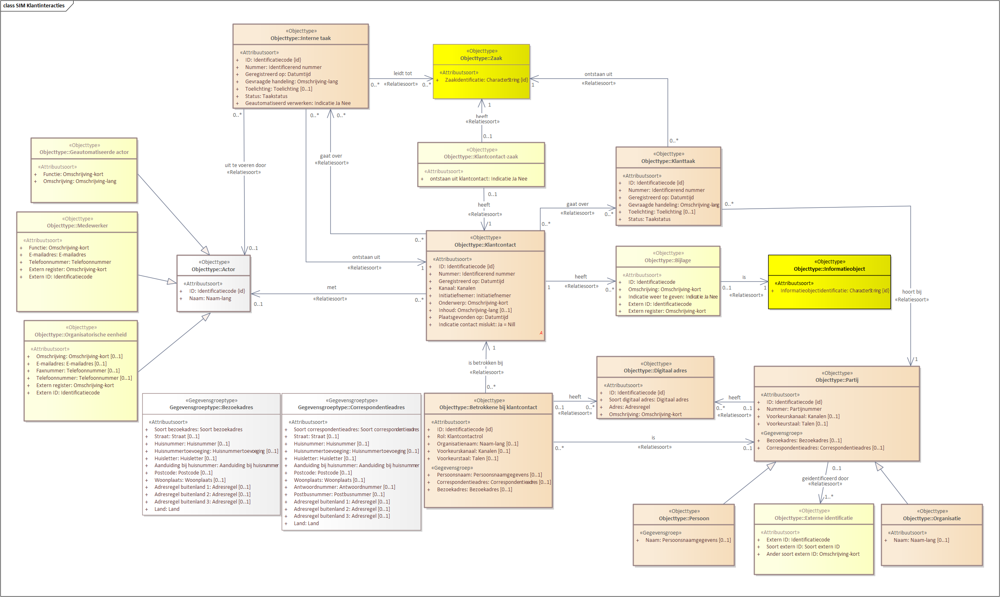

# Semantisch informatiemodel

## Modellering in Enterprise Architect
Binnen VNG Realisatie wordt Enterprise Architect (EA) gebruikt voor de vastlegging van semantische informatiemodellen (SIM). Onderstaand figuur geeft de modellering van het SIM weer zoals deze in EA is gemodelleerd.

## Aanvullende voorbeelden
