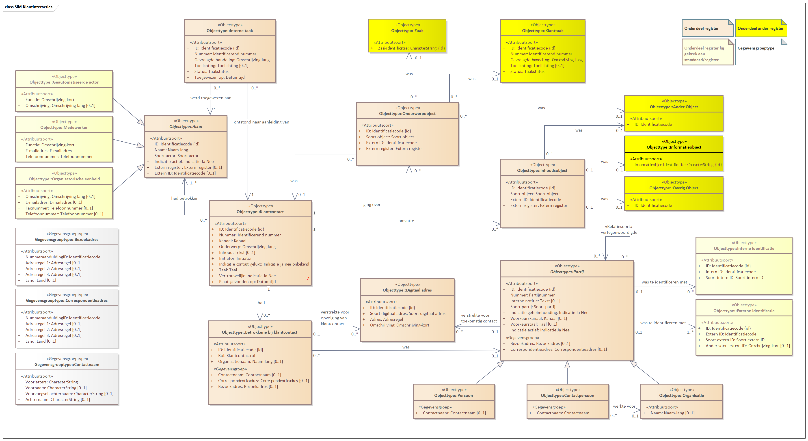
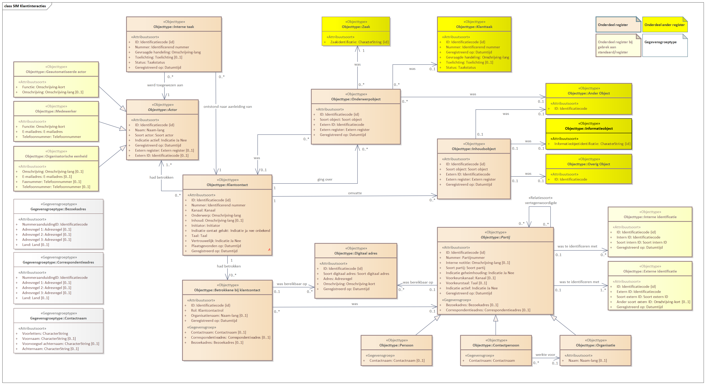
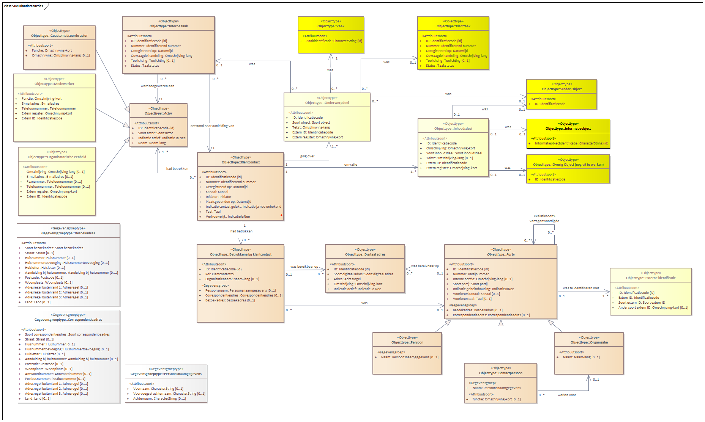

# Semantisch informatiemodel: Oude versies

## Modellering in Enterprise Architect
Binnen VNG Realisatie wordt Enterprise Architect (EA) gebruikt voor de vastlegging van semantische informatiemodellen (SIM). 
Onderstaand zijn de diagrammen van de oude versies van het infromatiemodel weergegeven en zijn de wijzigingen opgesomd die in het nieuwe model zijn doorgevoerd. 

## Van versie 0.0.4 naar 0.0.5 (11-10-2023)
Onderstaand figuur geeft de modellering van het SIM versie 0.0.4 weer zoals deze in EA was gemodelleerd.

De wijzigingen die in versie 0.0.5 zijn doorgevoerd t.o.v. deze versie zijn: 
  - Identificatoren van voorkomens van een objecttype in een ander register zijn verder uitgewerkt en overal op dezelfde wijze toegepast.
    - Naar aanleiding hiervan is het gegevensgroeptype *Identificator* toegevoegd.
    - Gegevensgroeptype *Identificator* vervangt de attribuutsoorten *Extern register* en *Extern ID* in de volgende objecttypes:
      - *Actor* middels de gegevensgroep *Actoridentificatie*
      - *Onderwerpobject* middels de gegevensgroep *ObjectIdentificator* 
      - *Inhoudsobject* middels de gegevensgroep *ObjectIdentificator* 
  - De objecttypen *Interne identificatie* en *Externe identificatie* zijn samengevoegd in nieuw objecttype *Partij-identificator*. Bij dit objecttype:
    - is toegevoegd een gegevensgroep van type *Identificator* onder de naam *Partij-identificator*
    - is toegevoegd de attribuutsoort *Andere partij-identificator* om verwijzingen naar niet-voorgedefinieerde externe objecten te registreren
  - In het gegevensgroeptype *Contactnaam* zijn de attribuutsoorten nu voorzien van een primitief datatype.
  - Referentielijsten *Soort Intern ID* en *Soort extern ID* zijn verwijderd.
  - Referentielijst *Soort Object ID* is toegevoegd.
  - Enkele definities van relaties zijn aangepast.

## Van versie 0.0.3 naar 0.0.4 (05-10-2023)
Onderstaand figuur geeft de modellering van het SIM versie 0.0.3 weer zoals deze in EA was gemodelleerd.

De wijzigingen die in versie 0.0.4 zijn doorgevoerd t.o.v. deze versie zijn: 
  - Primitief datatype Tekst (1000 karakters) toegevoegd
  - Bij alle objecttypen waar Geregistreerd op een eigenschap was is deze nu verwijderd.
  -	Objecttype Klantontact:
    -	Inhoud heeft als primitief datatype Tekst gekregen.
  -	Relatie was (tussen Onderwerpobject en Zaak)
    -	Kardinaliteit bij Zaak aangepast van 1 naar 0..1.
  -	Objecttype Partij:
    -	Interne notitie heeft als primitief datatype Tekst gekregen.
  -	Objecttype Interne Taak:
    -	Toegewezen op toegevoegd.
  -	Diverse beschrijvingen van objecttypen, attribuutsoorten en relaties aangescherpt om beoogd gebruik beter te illustreren.

## Van versie 0.0.2 naar 0.0.3
Onderstaand figuur geeft de modellering van het SIM versie 0.0.2 weer zoals deze in EA was gemodelleerd.

De wijzigingen die in versie 0.0.3 zijn doorgevoerd t.o.v. deze versie zijn: 
  -	De definities en de MIM-egenschappen "Herkomst" en "Herkomst Definitie" zijn gecorrigeerd.
    Definities van objecttypen en attribuutsoorten die aan andere informatiemodellen zijn ontleend zijn gelijkgetrokken met de definities uit die informatiemodellen.
   	Met de "Herkomst" en de "Herkomst definitie" meta-eigenschappen wordt naar de juiste bron verwezen. 
  -	Gegevensgroeptype Persoonsnaamgegevens:
    -	is gewijzigd naar Contactnaam.
    -	Voorletters toegevoegd.
  -	Gegevensgroeptype Bezoekadres:
    -	De specifieke adres attributen zijn verwijderd en er is een verwijzing naar de BAG toegevoegd (nummeraanduiding)
    -	Er zijn drie adresregels toegevoegd om adressen vast te leggen die niet in de BAG voorkomen.
  -	Gegevensgroeptype Correspondentieadres:
    -	De specifieke adres attributen zijn verwijderd en er is een verwijzing naar de BAG toegevoegd (nummeraanduiding)
    -	Er zijn drie adresregels toegevoegd om adressen vast te leggen die niet in de BAG voorkomen. 
  -	Objecttype : Geautomatiseerde actor
    -	is lichtgeel gemaakt (onderdeel van het register bij gebrek aan geautomatiseerder actor-register)
  -	Objecttype : Actor
    - Extern Register en Extern ID zijn toegevoegd en optioneel gemaakt.
    - Geregistreerd op is toegevoegd
    - Extern regsister is van het type referentielijst geworden.
  - Objecttype : Medewerker
    - Extern Register en Extern ID zijn verplaats naar Actor omdat die nu ook relevant zijn voor de Geautomatiseerde actor
  - Objecttype : Geautomatiseerde eenheid
    - Extern Register en Extern ID zijn verplaats naar Actor omdat die nu ook relevant zijn voor de Geautomatiseerde actor
  - Objecttype : Klantcontact
    - Inhoud is toegevoegd
    - Onderwerp is toegevoegd
  - Objecttype : Onderwerpdeel
    - is gewijzigd naar Onderwerpobject.
    - Tekst is verwijderd
    - Geregistreerd op is toegevoegd
    - Extern regsister is van het type referntielijst geworden.
  - Objecttype : Inhoudsdeel
    - is gewijzigd naar Inhoudsobject.
    - Tekst is verwijderd
    - Soort inhoudsdeel is Soort object geworden (analooog aan Onderwerpobject)
    - Geregistreerd op is toegevoegd
    - Omschrijving is verwijderd
    - Extern regsister is van het type referentielijst geworden.
  - Objecttype : Betrokkene bij klantcontact
    - Persoonsnaam is gewijzigd in Contactnaam
    - Geregistreerd op is toegevoegd
  - Objecttype : Partij
    -  Indicatie actief toegevoegd
    -  Geregistreerd op toegevoegd
  -  Objecttype : Persoon
     - Naam is gewijzigd naar Contactnaam
  -  Objecttype : Contactpersoon
     - Naam is gewijzigd naar Contactnaam
     - Functie is verwijderd
  - Objecttype Digitaal adres
    - Indicatie actief is verwijderd
    - Geregistreerd op toegevoegd
  - Objecttype : Externe identificatie
    - Geregistreerd op is toegevoegd
  - Objecttype : Interne Taak
    - Geregistreerd op is toegevoegd
  - Nieuw Objecttype Interne Identificatie toegevoegd. 
  - Relatie : ging over (tussen Klantcontact en Onderwerpobject (was Onderwerpdeel)
    - Kardinaliteit bij Onderwerpobject is gewijzigd van 1..* naar 0..*)
  - Relatie : omvatte (tussen Klantcontact en Inhoudsobject (was Inhoudsdeel)
    - Kardinaliteit bij Inhoudsobject is gewijzigd van 1..* naar 0..*)
  - Relatie : was (tussen Onderwerpobject (was Onderwerpdeel en Interne taak)
    - is verlegd van Interne taak naar klantcontact. Het onderwerp zal nooit de interne taak zijn, maar het Klantcontact dat n.a.v. de interne taak is ontstaan.
  - Legenda toegevoegd

## Van versie 0.0.1 naar 0.0.2
Onderstaand figuur geeft de modellering van het SIM versie 0.0.1 weer zoals deze in EA was gemodelleerd.

De wijzigingen die in versie 0.0.2 zijn doorgevoerd t.o.v. deze versie zijn: 
  -	Alle objecten hebben een ID gekregen.
  -	Partij
    -	Aan *Partij* is het attribuut *Soort partij* toegevoegd
    -	Bij *Partij* is het subtype *Contactpersoon* toegevoegd. 
    -	Het object *Werkt voor* met de bijbehorende relaties is nu gemodelleerd als de *werkte voor* relatie van de *Contactpersoon* naar de *Organisatie*.
    -	De relaties *vertegenwoordigt* en *wordt vertegenwoordigd door* is vervangen door een recursieve relatie *vertegenwoordigde* op *Partij*
  -	Interne taak
    -	Bij *Interne taak* komt *indicatie geautomatiseerd* verwerken te vervallen. Als een *Interne Taak* gekoppeld is (via uit te voeren door)  aan een *geautomatiseerde actor* dan is dat dus een geautomatiseerd te verwerken taak.
    - Dat een Interne taak  geleid kan hebben tot een Zaak hebben wordt niet als relevant voor klantinteracties gezien en de relatie is ontstaat uit tussen Interne taak en Zaak is verwijderd.​
    - Dat een Interne Taak is ontstaan uit een Klantcontact wordt nu vastgelegd middels het attribuut  ontstaan uit klantcontact in het Object van klantcontact.  De relatie ontstaan uit  is verwijderd. ​
  -	Klantcontact
    -	Bij *Klantcontact* is het attribuut *Initiatiefnemer* hernoemd naar *Initiator*. 
    -	Bij *Klantcontact* is het attribuut *Vertrouwelijk* opgenomen om aan te geven dat een *Klantcontact* vertrouwelijk behandeld moet worden. Welke consequenties het vertrouwelijk zijn heeft moet nog in beeld gebracht worden. 
    -	De relatie met *Actor* is hernoemd naar *heeft als betrokkene* en de kardinaliteit bij de *Actor* is veranderd van 1 naar 1..*. Dit omdat er meerdere *Actoren* bij een *Klantcontact* betrokken kunnen zijn (bv. Bij een keukentafelgesprek) 
    -	De relatie *Is betrokken bij* (tussen *Klantcontact* en *Betrokkene bij klantcontact*) is van richting veranderd en heet nu *Heeft als betrokkene*. (Deze relatie is nog onderwerp van nadere analyse) 
    -	Het attribuut *Inhoud* is verwijderd. Alle inhoud wordt nu opgenomen in *Inhoudsdelen*.
    -	Het attribuut *onderwerp* is verplaatst naar het object *Onderwerpdeel* als *Tekst*
    -	Het attribuut taal is toegevoegd
  - Betrokkene bij klantcontact​
    - De attributen voorkeurstaal en voorkeurskanaal zijn verwijderd.​
  -	Actor    
    -	De attributen *Indicatie actief* en *Soort actor* zijn toegevoegd. De gewijzigde relaties zijn al eerder benoemd. 
  - Onderwerpdeel
    - De *gaat over* relaties zijn opnieuw gemodelleerd. 
    -	Objecttype *Klantcontact Bij Zaak* is vervallen
    -	Objecttype  *Onderwerpdeel* is toegevoegd
    -	*Gaat over* relaties tussen *Klantcontact* en respectievelijk *Zaak*, *Klanttaak* en *Ander Object* lopen nu via Onderwerpdeel
    -	Ook de *Gaat over* relatie tussen *Klantcontact* en *Interne Taak* loopt nu via *Onderwerp*.
  -	Klanttaak
    -	*Klanttaak* is buiten het domein van klantinteracties geplaatst 
    -	De relatie *ontstaan uit* tussen *Klanttaak* en *Zaak* ligt daarmee buiten het domein van Klantinteracties en is dus uit het informatiemodel verwijderd.  
    -	De relatie tussen *Klanttaak* en *Partij* is verwijderd want deze relatie ligt buiten het domein van Klantinteracties.
  -	Inhoudsdeel
    -	*Bijlage* is hernoemd naar *Inhoudsdeel* 
    -	Aan *Inhoudsdeel* zijn de attributen *Soort inhoudsdeel* en *Tekst* toegevoegd.
    -	De *Indicatie weer te geven* is verwijderd.  
    -	Het *Object (nog uit te werken)* dat met de betreft relatie aan het *Klantcontact* was gekoppeld is nu via het *Inhoudsdeel* gerelateerd aan het *Klantcontact* en hernoemd naar *Overig Object*.
    -	Er is een relatie *is* toegevoegd tussen het *Inhoudsdeel* en het *Ander object*. Daarmee kan een gestructureerd object gerelateerd worden zonder dat dat vanuit deze standaard wordt voorgeschreven. 
  -	Digitaal Adres
    -	Aan het *Digitaal Adres* is het attribuut *Indicatie actief* toegevoegd

