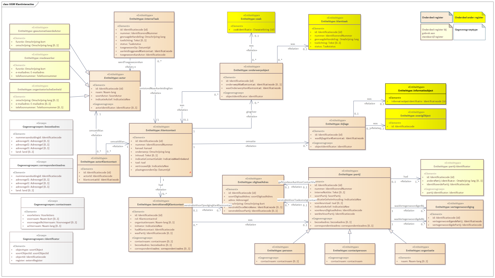

# Uitwisselingsgegevensmodel (UGM)

## Kern
Om tot een gegevensmodel voor de uitwisseling te komen kijken we vooral naar het praktische gebruik van het model. 

Voor snelle en succesvolle eerste implementaties van de API willen we eenvoud. Tegelijkertijd willen we leveranciers niet tegenhouden om klantinteracties direct goed te implementeren. Binnen het uitwisselingsgegevensmodel concretiseren we een de implementatie van relaties uit het informatiemodel. Dat doen we door verwijzende sleutels naar gerelateerde resources op te nemen en , waar sprake is ven een meer op meer relatie, koppel-resources te introduceren. 
Ook worden keuzes gemaakt t.a.v. de wijze waarop supertypes en subtypes worden geïmplementeerd.

## Modellering in Enterprise Architect
Binnen VNG Realisatie wordt Enterprise Architect (EA) gebruikt voor de vastlegging van uitwisselingsgegevensmodellen. Onderstaand figuur geeft de modellering van het Uitwisselingsgegevensmodel dat gebaseerd is op informatiemodel versie 0.0.5 weer.

