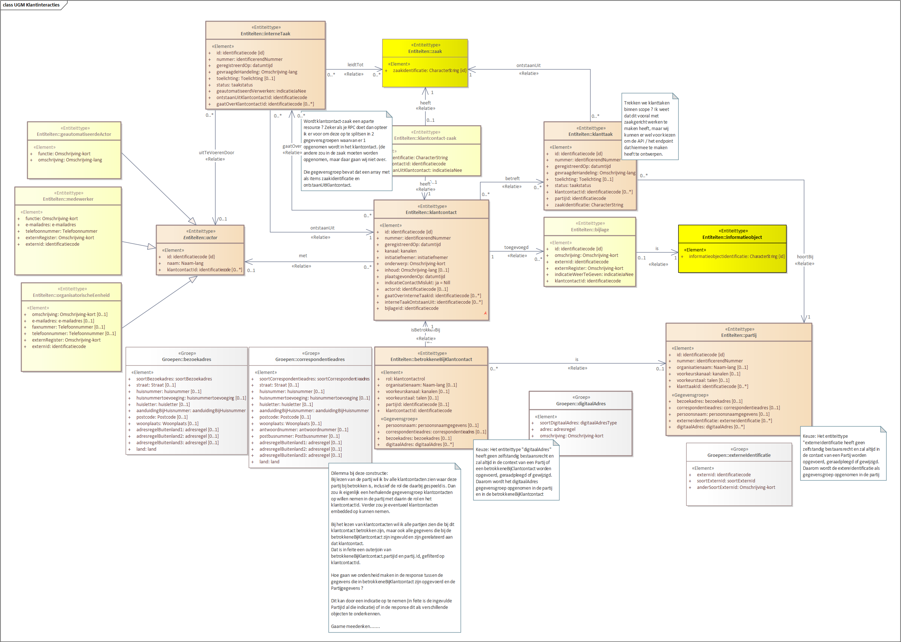

# Oude versies van het Uitwisselingsgegevensmodel (UGM)

Niet van iedere versie van het informatiemodel zijn uitwisselingsmodellen gemaakt.

De eerste versie van het uitwisselingsmodel voor klantinteracties is destijds opgesteld om een aantal varinaten van API-design te schetsen 
zoals de CRUD-API, Handelingsgedreven API en de Lees-API op basis van gebruik. Om inzicht in de ontwikkeling van het gedachtengoed rond 
klantinteracties te bieden worden de oude versie van de uitwisselingsmodellen bewaard.

## Versie op basis van één van de eerste informatiemodellen voor klantinteracties

