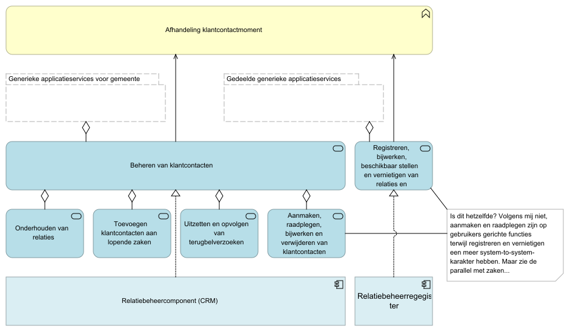
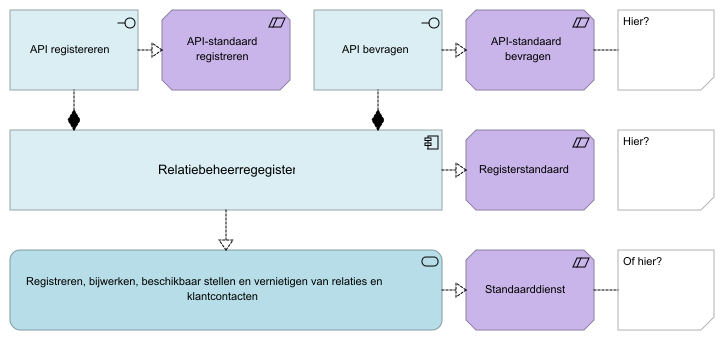

# Productvisie vanuit vastleggingsperspectief

## Waarom deze standaarden?

Gemeenten hebben een moderne informatievoorziening nodig. In de huidige situatie is het lastig om te vernieuwen en zorgvuldig om te gaan met gegevens. Dat staat de verbetering van de gemeentelijke dienstverlening in de weg. VNG Realisatie werkt samen met gemeenten aan architectuur en standaarden die de kaders bieden voor deze moderne informatievoorziening. Eén van de uitgangspunten daarbij is dat inwoners en ondernemers tijdig en volledig geïnformeerd kunnen worden. De API-standaarden voor Klantinteracties helpen daarbij.

Hoe noemen we dit product of deze productfamilie? 'API-standaarden voor Klantinteracties', 'Registerstandaard voor relatiebeheer' of 'Gedeelde generieke applicatieservice voor het registreren en delen van relaties en klantcontacten'?

{:height="40%" width="40%"} 

{:height="35%" width="35%"} 

{:height="25%" width="25%"} 

{:height="32%" width="32%"} 

## Wat leveren deze standaarden op voor gemeenten?

- __Organisatiebrede bijhouding van interacties met inwoners en ondernemers.__ In het zaakgericht werken registreerden we al informatie over interacties met inwoners en ondernemers in het kader van een zaak. Met een 'zelfstandige' standaard voor contactmomenten kunnen die interacties ook eenvoudig worden geregistreerd en ingezien waar niet zaakgericht wordt gewerkt.
- __Scheiding tussen 'klantorders' en interne 'productie- of pickorders'.__ Door de introductie van productaanvragen kunnen we met inwoners en ondernemers communiceren op basis van een voor hen herkenbaar concept: het bestelde product. Zaken kunnen daardoor volledig worden ingericht op het procesverloop bij de gemeente - zonder (ook) oog te moeten houden voor de herkenbaarheid van het zaaktype voor de initiator.
- __Herbruikbare contactgegevens en klantvoorkeuren.__ Er bestaat op dit moment geen basis- of (gestandaardiseerde) gemeentelijke kernregistratie voor het registreren van contactgegevens van inwoners of ondernemers waarmee de gemeente een relatie heeft. Dat leidt ertoe dat zij vaker dan nodig worden gevraagd deze gegevens te verstrekken. Een standaard voor contactgegevens en klantvoorkeuren maakt deze gegevens gemeentebreed voor hergebruik beschikbaar.
- __Ondersteuning van samengestelde klantbeelden en omnichannel-oplossingen.__ Gemeenten hebben veelal alleen fragmentarisch zicht op interacties met inwoners en ondernemers, terwijl vanuit dienstverleningsoogpunt juist een zo compleet (als binnen wettelijke kaders) mogelijk klantbeeld gewenst is. De drie API-standaarden voor Klantinteracties samen ondersteunen dit doel.

## En wat nog meer (nieuw)?

#### Verantwoording

- We kunnen verzoeken volgen vanaf het moment van indiening en ons daardoor verantwoorden over de complete afhanndeling. Meteen een ontvangstbevestiging versturen (Wmebv).

### Stap richting informatievoorziening volgens visie Common Ground

- Principe 'maximaal standaardiseren'.

## En wat leveren deze standaarden op voor leveranciers?

- __Waardevolle gegevens gestandaardiseerd toegankelijk.__ Gestandaardiseerde interfaces en onderliggende databronnen maken het makkelijker nieuwe dienstverleningstoepassingen te ontwikkelen.
- __Uniformeren gemeentelijke opdrachtverstrekking.__ Standaarden uniformeren vragen van opdrachtgevers en vereenvoudigen implementatie.

# Productvisie vanuit gebruiksperspectief